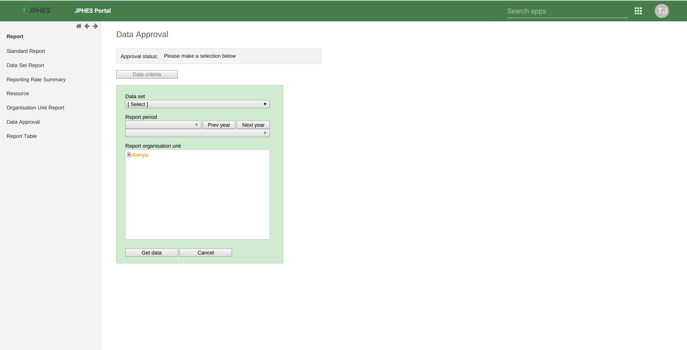
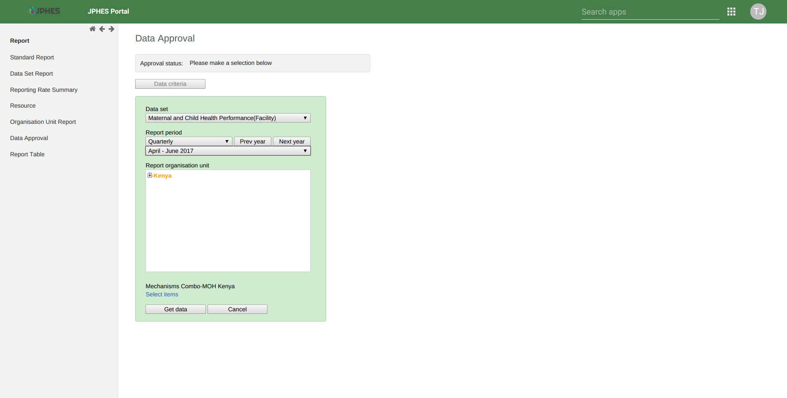
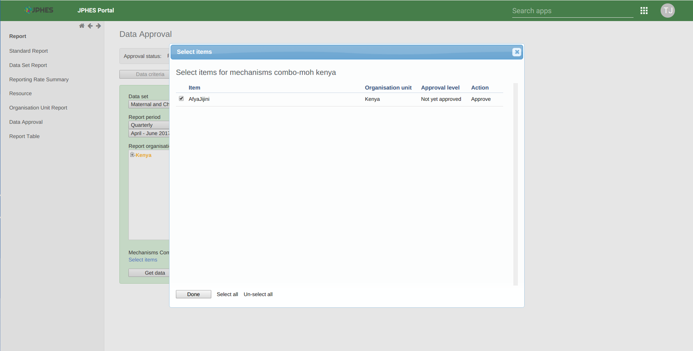
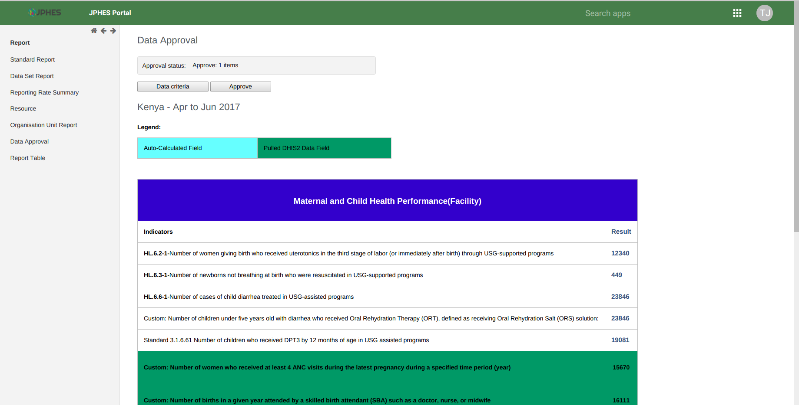

Data Approval
==============
How to Approve data
---------------------
1. On the search menu select the reports App, then click on the *Data Approval* link on the side menu.

.. note:: Only CoPs have approval permissions in the platform.

Fig -Data Approval Page.

2. Select a data set to approve, the period(based on the reporting period of the data set) and then Kenya(Represents Mechanism level).

.. note:: If the **reporting organisationunit hierarchy** does not appear on the data approval page. Navigate to **data entry app** and search for any facility on the search menu. Once the hierarchy appears on the data entry screen go back to data approval page, and the hierarchy should appear. *It's an issue of browser caching, to be fixed soon*. 

Fig -Selecting Options(*Data Set, Period and Kenya-Mechanism level*)

3. Then click on the mechanism combo (*select items*) to select your mechanism on the pop-up menu.

Fig -Selecting mechanism on the pop-up menu.

3. Lastly, click on **Get data button** to generate and display the data set report based on your selected options. Confirm the values on report and click **Approve** if they're okay.

Fig -Data Set report to approve.

.. note:: Once a data set report for a specified period is approved no updates can be done on the data. To make updates the data set report should be unapproved first.
