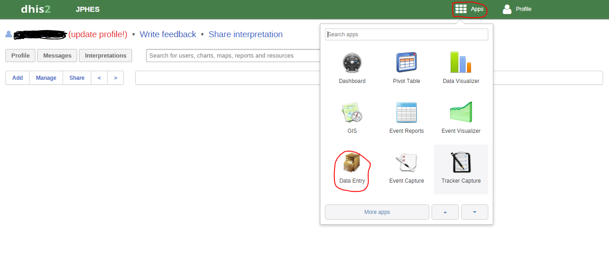
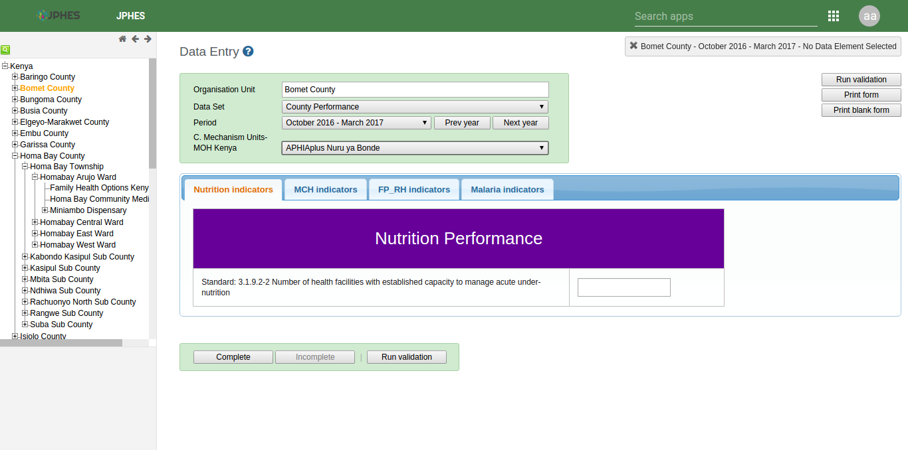
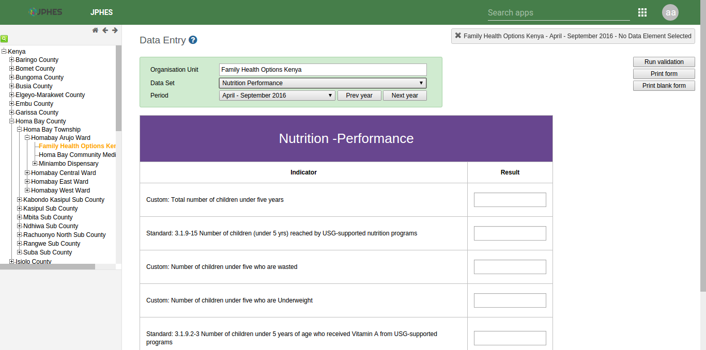
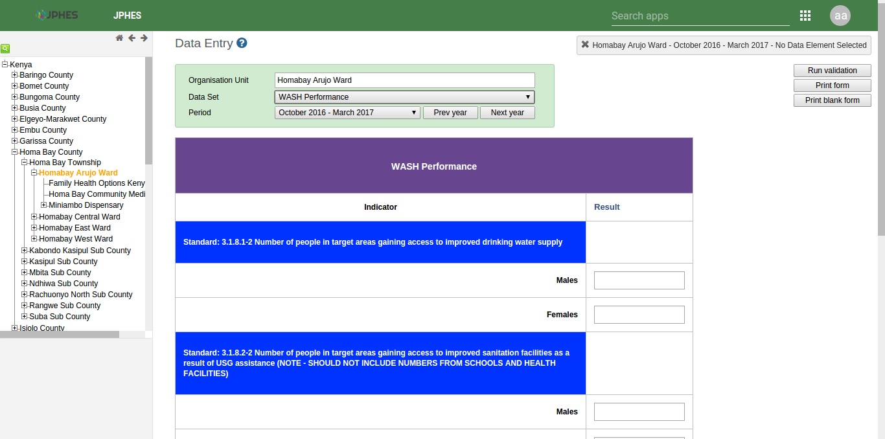
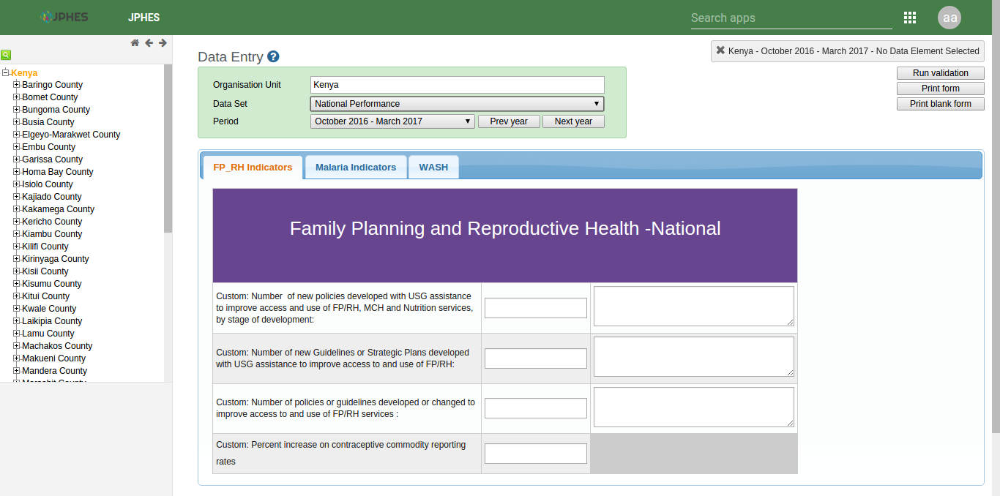

Data Entry
==========
The JPHES data entry module is designed in such a way that an Implementing Partner can only enter their data. Data entry in JPHES is done as
per the level of the dataset, that is National, County, Ward and Facility. After logging into the system, hover mouse pointer / click on the
*Apps* icon on the far left as shown on the figure below. On the dropdown that appears, click on *Data Entry* icon.

This navigates to the data entry page, as shown on the figure below. For data entry forms to appear, you will be required to first select an
organization unit/facility you are reporting for on the left panel, the dataset, reporting period and the implementing partner you are
reporting for, which comes up after selecting the *organization unit*, *Dataset* and *period* that the user is reporting for.

Data Entry Forms
----------------
Below are sample screenshots for different data entry forms;

1. Facility Level
-----------------
Nutrition Performance Dataset

2. Ward Level
-------------

Wash Performance Dataset

3. County Level
---------------

County Performance Datasets

4. National Level
-----------------

National Peformance Datasets

