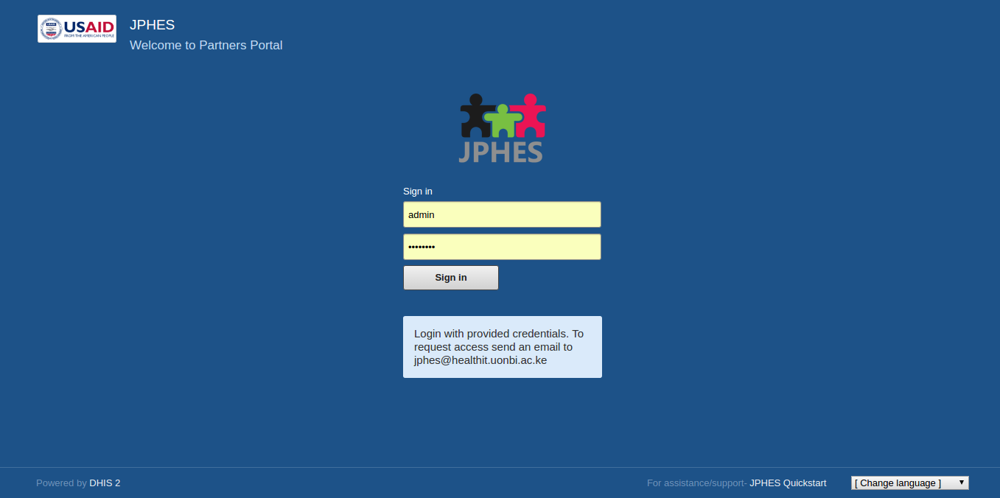
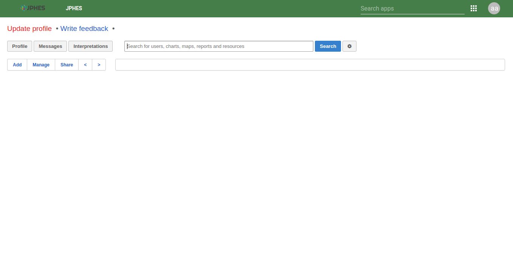
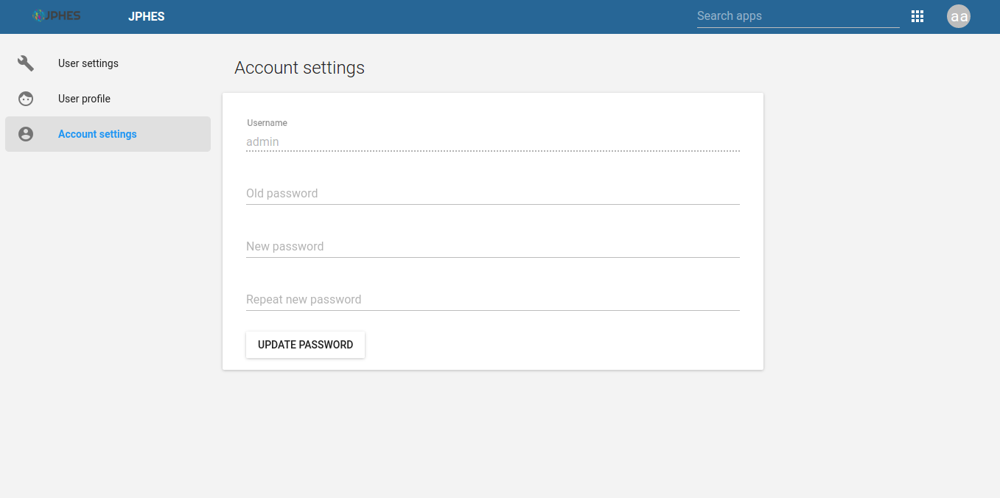
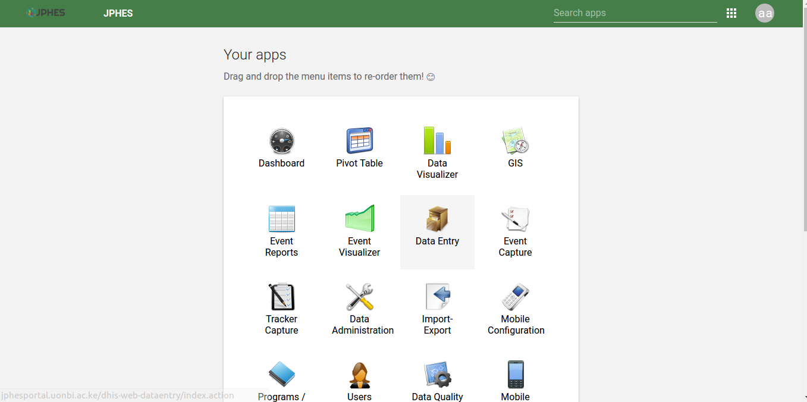
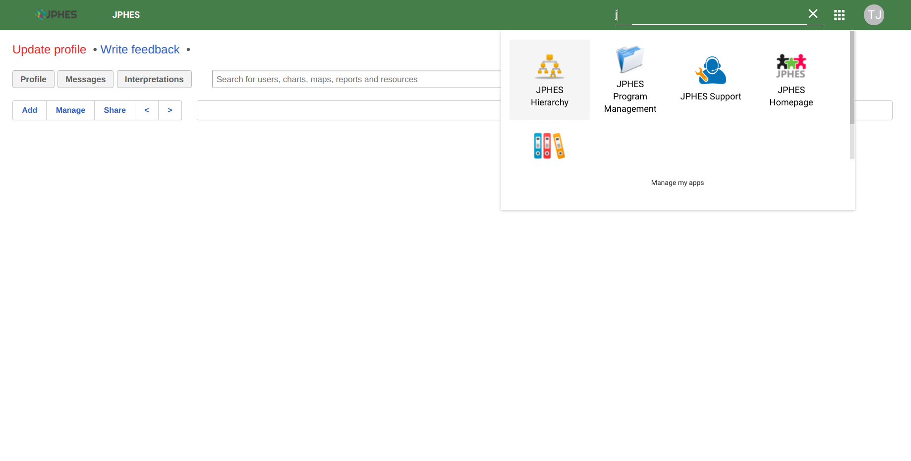

Getting Started
=====================

System Access
--------------
Access *JPHES* via `http://jphesportal.uonbi.ac.ke <http://jphesportal.uonbi.ac.ke>`_ .
To login to the platform, provide your username and password then click the login button.

.. note:: If you have challenges signing in, send an email to jphes@healthit.uonbi.ac.ke for assistance or via the jphes servicedesk

.. _login_page:

Fig.- JPHES Login Page

If successful, it directs you to the JPHES dashboard.

.. _landing_page:

Fig.- Landing page

To change password, click on the user profile app.

Fig.- Change User password

JPHES/DHIS2 Applications
--------------------------
Available applications in the platform.

.. note:: These applications will be visible based on your user role in the platform.

.. _apps_page1:

Fig.- Apps page 1

**Custom JPHES Apps**

* JPHES Hirerachy - For creating and maintaining the attribution hierarchy.
* JPHES Programs - For grouping data elements and indicators.
* JPHES Support - Redirects to the `JPHES Servicedesk page <https://jphes-support.on.spiceworks.com/portal/>`_.
* JPHES Documentation - Redirects to the JPHES documentations.
* JPHES Homepage - Redirects to the `JPHES Homepage <http://jphes.uonbi.ac.ke>`_

.. _apps_page2:

Fig.- Apps page 2

Navigate to the about page using the account icon.

.. _about_page:
.. figure::  _static/images/jphes-about.png
   :align:   center

Fig.- About Page

JPHES Functionalities
-------------------------
**What the user can do**

* Create/delete/update/view  programs.
* Create/update/view Support  programs.
* Create/update/view support agencies.
* Create/update/view users within a certain level e.g mechanism, agency or donor levels.
* IPSL management.
* Pull Data from the National DHIS2.
* Data Push to DATIM4U.
* Perform data attribution,.
* Reports (standard reports), Data Visualization, Data Entry and Pivot tables analysis.

JPHES Hierarchy
----------------

Fig. Hierarchy Units

National Unit Level
++++++++++++++++++++

* Create, Update and Remove Programs.
* Create, Update and Remove Development Partners e.g PEPFAR.
* Assign Programs to a Development Partner.
* View a list of the development partners.
* View details of each development partner such as the programs assigned and the agencies supported by the development partner.In addition, can drill down to the lowest level(mechansim).
* Analysis and reports for all units(Donor, Agency, and Mechanism).

Donor Unit LeveL
++++++++++++++++++

* Create, Update and Remove agencies.
* View a list of the agencies.
* View details of each agency: the programs assigned to the agency and the Implementing mechanisms the agency is supporting.
* Create, view and update users for this specific level.
* Analysis and reports for donor unit->agency units->mechanism units.

Agency Unit Level
+++++++++++++++++++

* Create, Update and Remove Implementing Mechanism.
* Assign programs to an Implementing mechanism.
* View the list of the Implementing mechanisms.
* View details of each IM: the programs supported and the facilities under the Implementing Mechanism.
* Analysis and reports for the agency unit->mechanism units.

Mechanism Unit Level
+++++++++++++++++++++++

* View a list of all facilities supported by the Implementing mechanism.
* View a list of the programs supported by the IM.
* Data Entry and approval
* Analysis and reports for the mechanism unit.
