Hierarchy
==========
To naviagate to the hierarchy app, search for *JPHES Hierarchy* on the search bar then click on it.

.. note:: functionalites available are based on user roles.

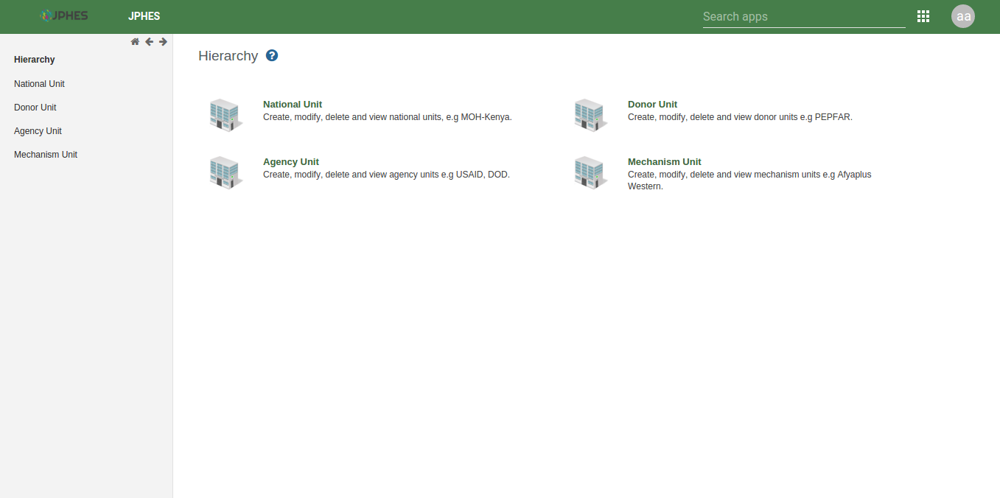

Fig -JPHES Hierarchy units.

National Unit Level
---------------------
Create and update national unit, and to create/update donor units.

List of National Unit
++++++++++++++++++++++++
.. note:: To display the pop-out menu(with options e.g update, view assigned progams, show details) click on a specific unit in the list.

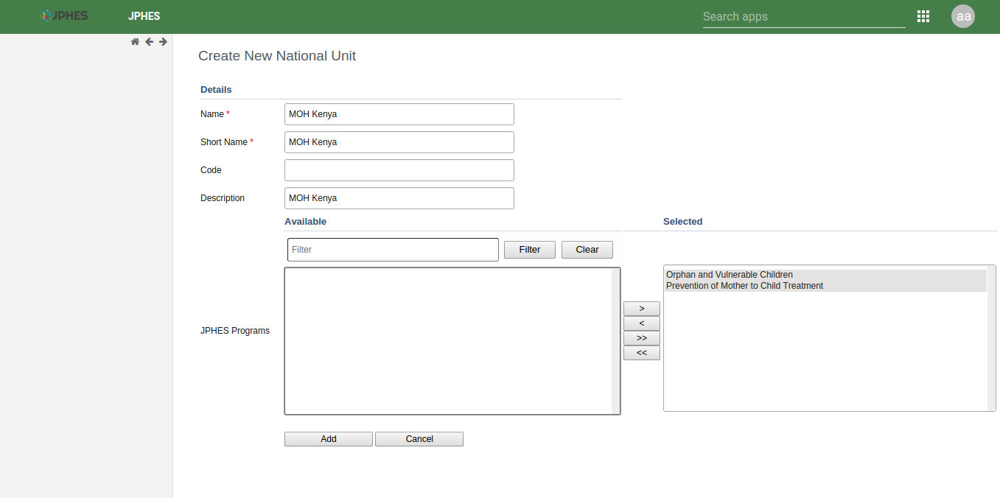

Fig -list of national units.

Add National Unit
+++++++++++++++++++
.. note:: Must provide supported programs.

.. figure::  _static/images/jphes-hierarchy-national-add.png
   :align:   center

Fig -Add a National Unit.

National Unit Details
+++++++++++++++++++++++
Click on the *show details* option in the menu popup.

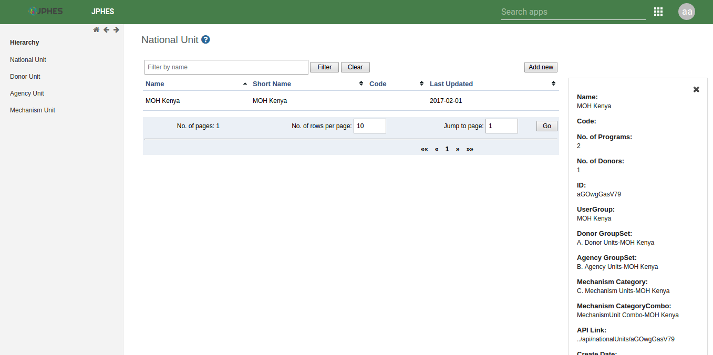

Fig -National Unit details.

Assigned National Unit Programs
++++++++++++++++++++++++++++++++
Click on the *assigned programs* option in the menu popup.

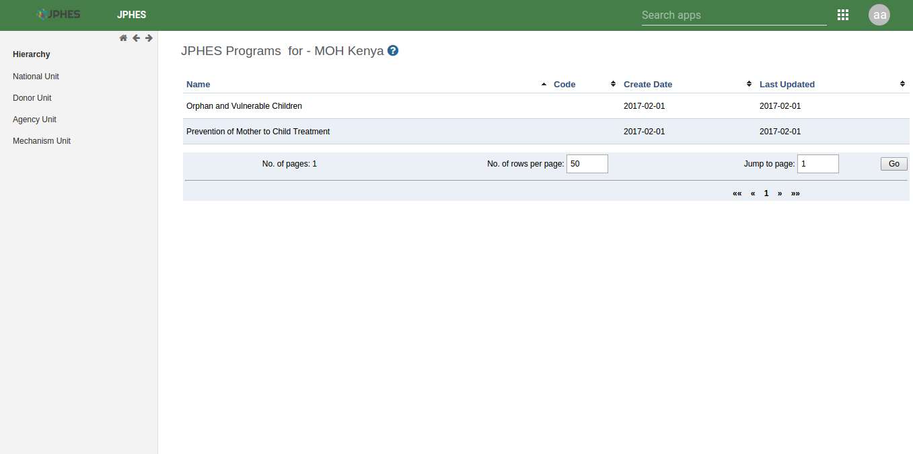

Fig -National Unit Programs.

Add a Donor Unit to a National Unit
+++++++++++++++++++++++++++++++++++++
Click on the *add donor unit* option in the pop-up menu on the national unit.

.. note:: Provide the supported programs by the donor unit.

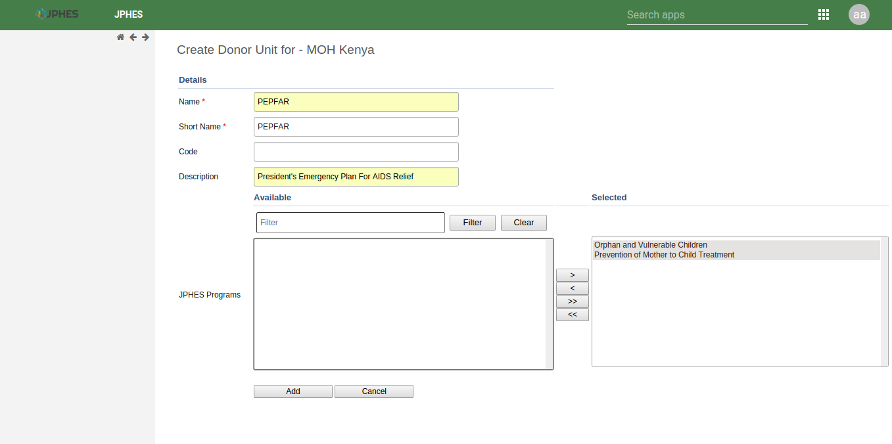

Fig -Adding a donor unit to a national unit.

Donor Unit Level
-------------------

List of Donor
+++++++++++++++++
.. note:: To display the pop-out menu(with options e.g add agency and show details) click on the donor unit in the list.

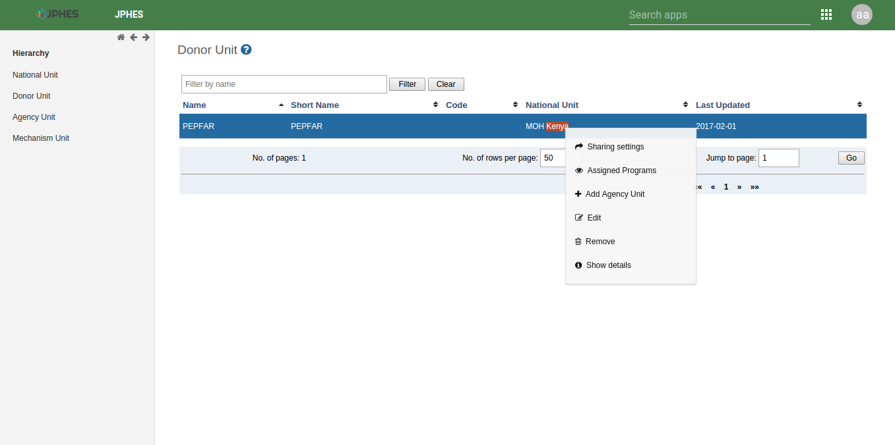

Fig -list of donors.

Add an Agency to a Donor Unit
++++++++++++++++++++++++++++++++
Click on the *add agency* option in the menu popup.

.. note:: Must provide programs supported by the agency.

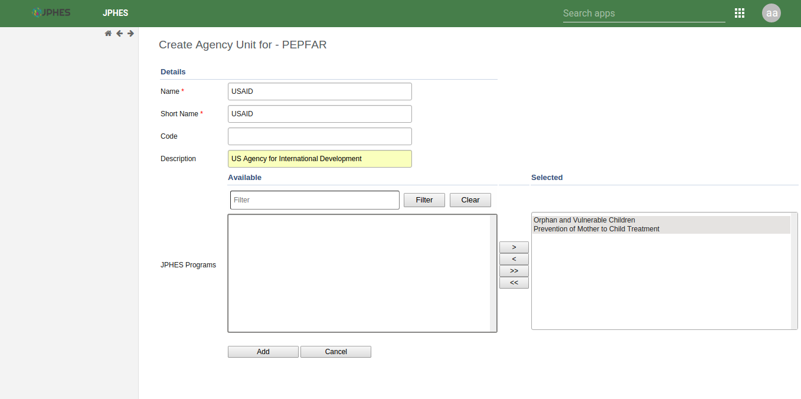

Fig - Adding an agency to a selected donor unit

Assigned Donor Unit Programs
++++++++++++++++++++++++++++++++
Click on the *assigned programs* option in the menu popup.

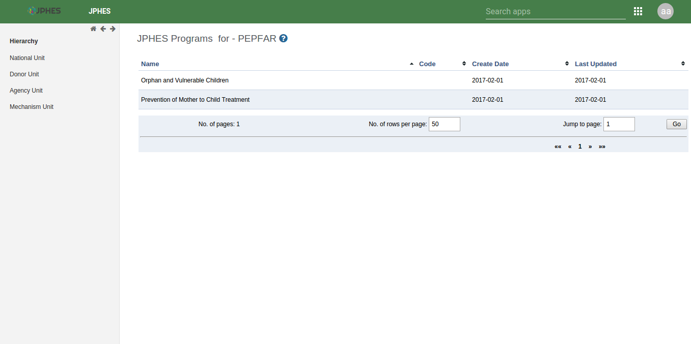

Fig - Donor Unit Programs.

Donor Details
+++++++++++++++++
Click on the *show details* option in the menu popup.

Fig -Viewing donor detials.

Agency Unit Level
-------------------
Create/update mechanism units.

List of Agency Unit
+++++++++++++++++++++
.. note:: To display the pop-out menu(with options e.g add mechanism, show details) click on an agency unit in the list.

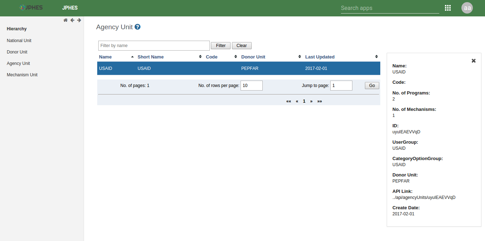

Fig -list of agency units.

Add Mechanism to an Agency
++++++++++++++++++++++++++++
Click on the *add mechanism* option in the menu popup.

.. note:: Must provide programs supported by the mechansism.

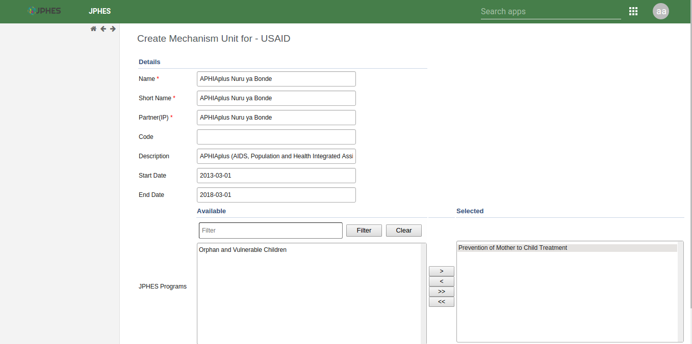

Fig -Adding a Mechanism to an agency unit

Assigned Agency Unit Programs
++++++++++++++++++++++++++++++++
Click on the *assigned programs* option in the menu popup.

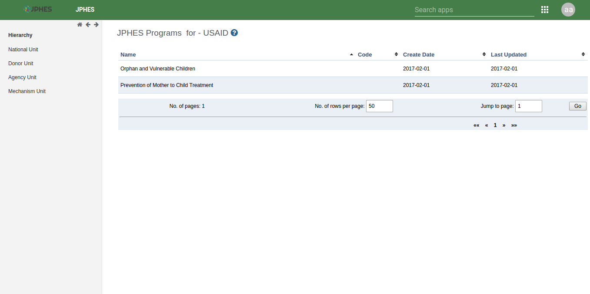

Fig - Agency Unit Programs.

Agency Details
+++++++++++++++++++
Click on the *show details* option in the menu popup.

Fig -View agency detials.

Mechanism Unit Level
---------------------
View details, programs and organisation units of the mechanism units

List of Mechanism Unit
+++++++++++++++++++++++++
.. note:: To display the pop-out menu(with options e.g show details) click on mechanism unit in the list.

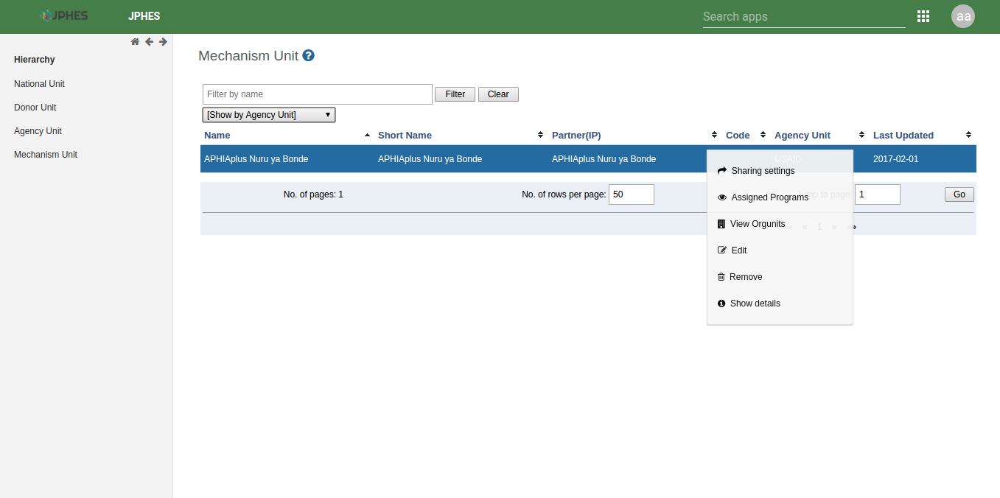

Fig -list of mechanism units.

Mechanism Details
+++++++++++++++++++
Click on the *show details* option in the menu popup.

.. figure::  _static/images/jphes-hierarchy-mechanism-showdetails.png
   :align:   center

Fig -Mechanism details.

Mechanism Programs
+++++++++++++++++++
Click on the *assigned programs* option in the menu popup.

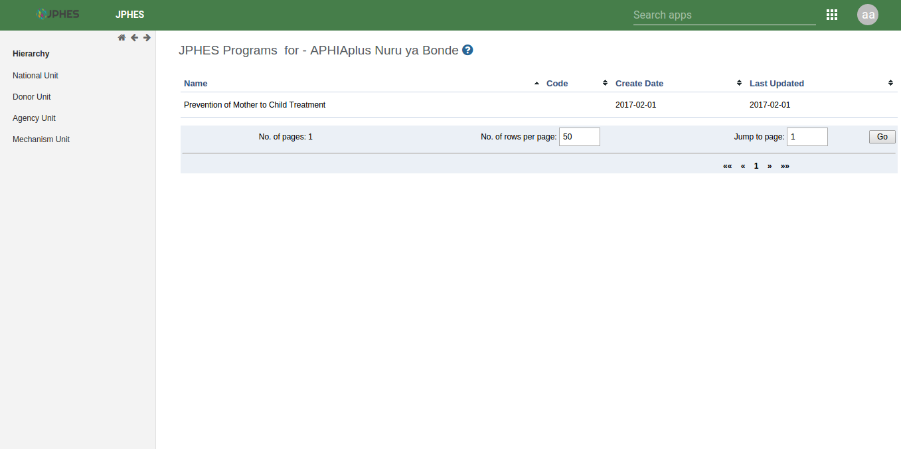

Fig -Mechanism programs.

Mechanism Orgunits
+++++++++++++++++++++
Click on the *view mechanism orgunits* option in the menu popup.

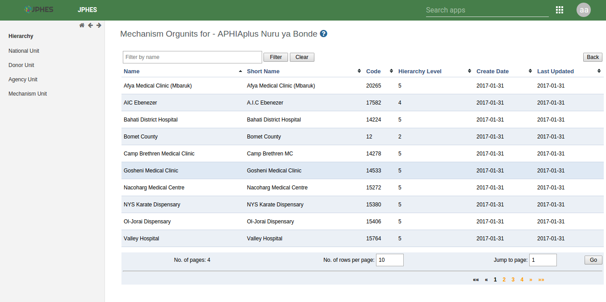

Fig -Organisation units supported.
