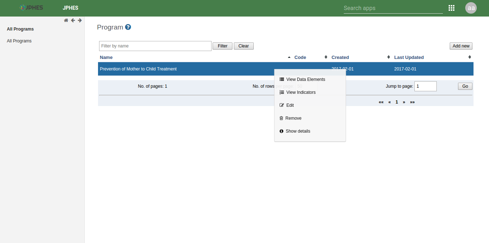
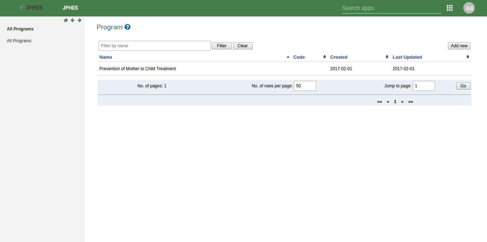
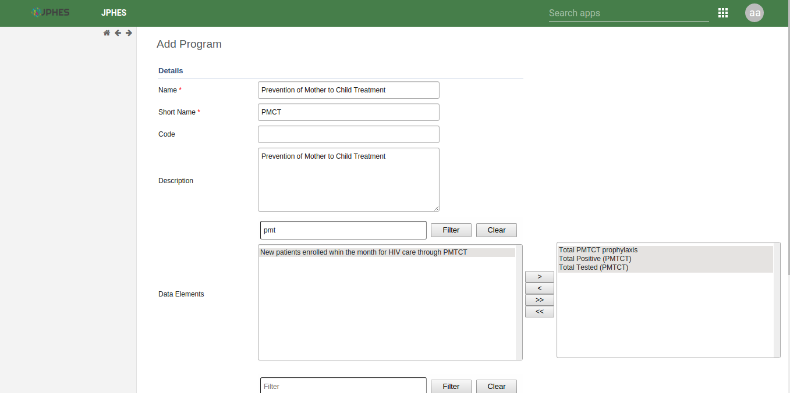
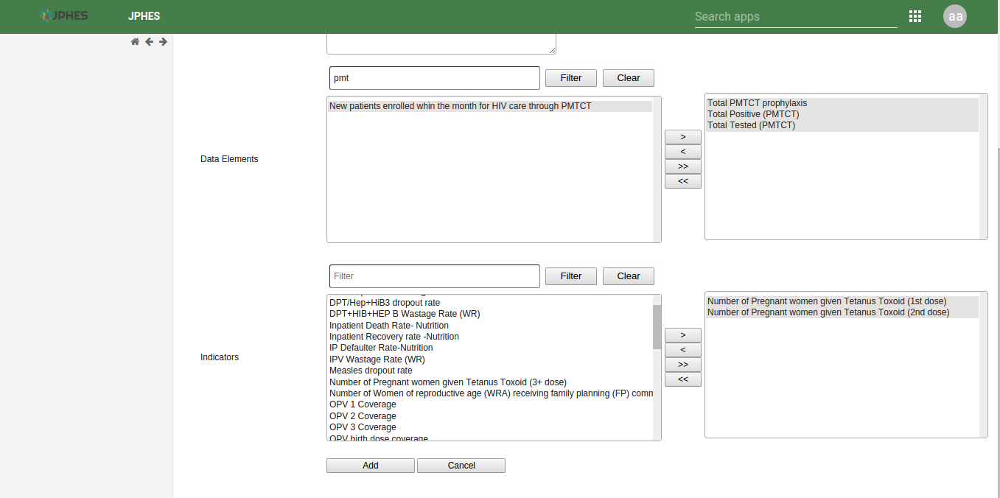
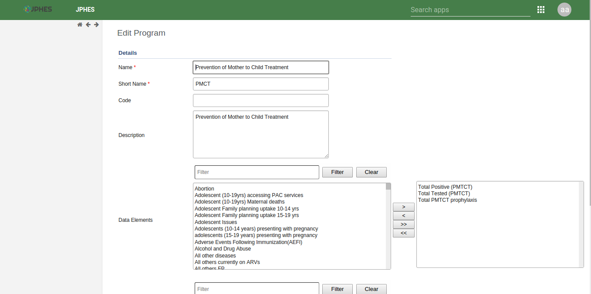
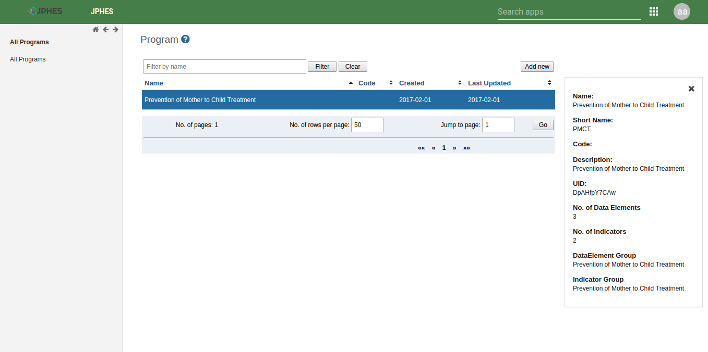
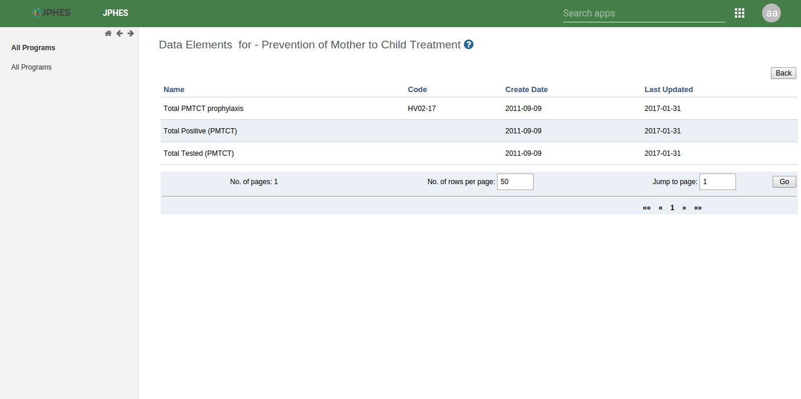
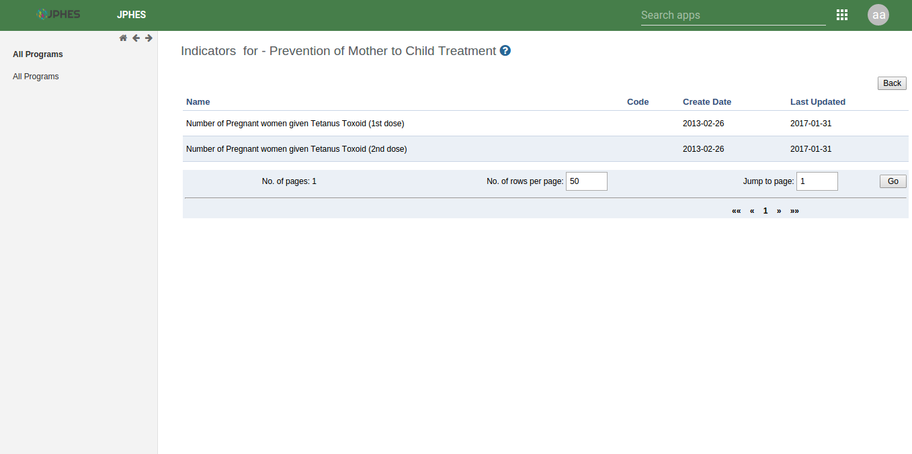

Programs
=========
To naviagate to the JPHES programs app, search for *JPHES Program Management* on the search bar then click on it.

.. note:: functionalites available are based on user roles.

Program List
---------------
This page displays the programs already created. On clicking on a program item a **pop up menu** appears that allows the user to perform functions such as:

- Show details of a program.
- Remove a program.
- Update a program.
- View program data elements.
- View program indicators.

Fig-Pop-up menu on the program list.

Fig-JPHES program list.

Creating a Program
--------------------
To display the program creation page, click on the *add button* on the program list page. During this process the user has to provide the program name, program short name, program description and select data elements/indicators for the program.

Fig-Add Program Page

Edit Program
--------------
To display the program edit page, on the pop-up menu select *edit* option. It allows the user to update details of the program such as the program name, short name, description, the data elements and indicators.

Fig- Program Edit Page

Show Program Details
----------------------
On the pop-up menu, select *show details* option to display program details. It shows summary details of the program such as number of data elements, program description and number of indicators.

Fig. Show Program Details.

View Program Data Elements
---------------------------
On selecting the *view dataelements* option on the pop-up menu. It displays the data elements assigned to the program.

Fig. Program Data elements.

View Program Indicators
---------------------------
On selecting the *view indicators* option on the pop-up menu. It displays the indicators assigned to the program.

Fig. Program Indicators
